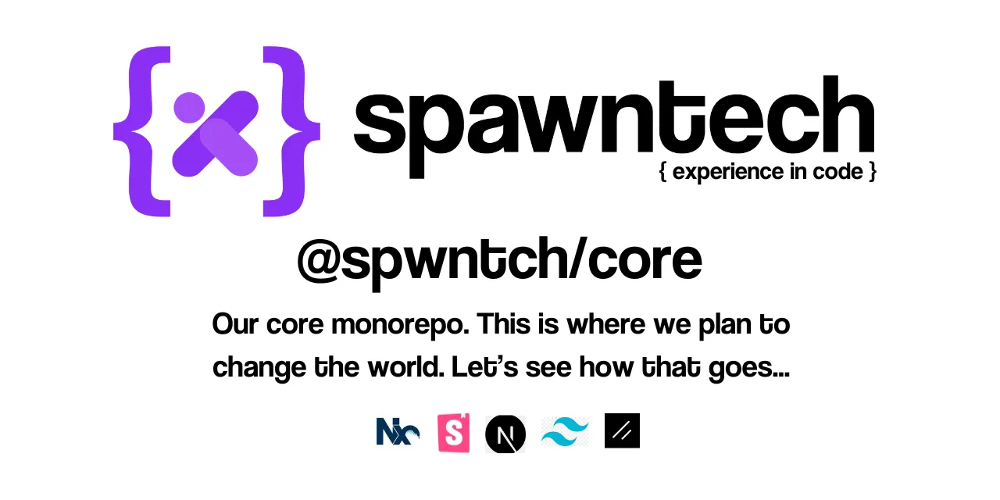

# @spwntch/spwn



## tldr;

Just get started. It's easy. You'll be guided as you go along.

```bash
pnpm dlx spawn-workspace
```

For more info, rather check out [@spwntch/workspace](https://github.com/spwntch/workspace) on [Github](https://github.com/spwntch). It is after all a more user-focussed repo and thus has better docs 😇.

> There is still much to document here, contirbutors welcome...
